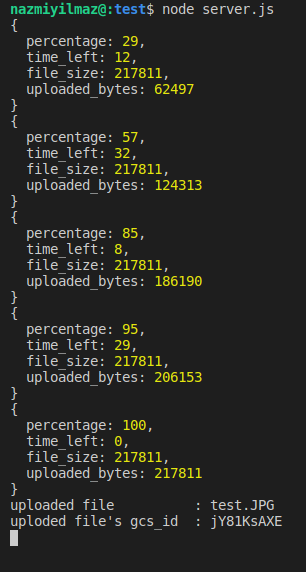

## gcs-multer

This is a very simple module that can be used to add file-upload funcionality to your app. This module is the combination of the "multer" and "google-apis". Aim of this project is to help people to add file-upload functionality in a very easy way.

#### Installation

`npm install gcs-multer`

#### Creating an Instance of gcs-multer

For creating an instance of gcs-multer, you need to provide following three properties. These three properties must be given to enable gcs-multer to access google cloud storage

```
const gcs_multer = require("gcs-multer");

const gcsm = new gcs_multer({
  project_id: "wired-height-276615",
  key_file: "./wired-height-276615-c511781c0400.json",
  default_bucket: "oncoev_resources",
  max_size: 1024 * 1024 * 16, //optional
  is_public: false, //optional
});
```

#### File uploading

For this operation, gcs-multer works as a middleware. After the uploading operation finished, the original file name and google-cloud-storage_id of the file will be attached to the request object. Later, this file can be reached by using this gcs_id.

Since these files are uploaded to the cloud with automatically generated unique ids, the original name of the file can be needed when reaching the file. For a clearer explanation, read the downloading part as well.

Also, the request should be a multipart request which includes a file with the field name 'file'

```
// Listener for the progress of the upload operation
const action = (info) => {
  console.log(info); // this function can be used to see the progress 
};

// Add gcs-multer as a middleware
app.post("/", gcsm.singleFile(action), (req, res, next) => {
  const name = req.filename;
  const id = req.gcs_id;

  console.log(`uploaded file          : ${name}`);
  console.log(`uploded file's gcs_id  : ${id}`);
});
```

In the example above, "action()" function is called in each step of the upload operation. Following is the console logs of this operation



[upload-console-logs.jpg](github.com/nazmi-yilmaz/gcs-multer/blob/master/upload_console.png)

This feature is added to the project to enable developers to reflect the progress to the user while the uploading operation continues.

#### File Downloading

The following is the download operation. gcs-multer generates a signed url for the file which can be used before the expiration date. In the following example, the url will redirect user to the download link and when the user downloads the file the file name will be prompted as the "original_file_name" to the user. User can use this url for the following 1 hour

```
app.get("/:id", (req, res, next) => {

  let expiresAt = Date.now() + 1000*60*60
  gcsm
    .getSignedURL(req.params.id, "original_file_name", expiresAt)
    .then((url) => {
      //the request is redirected to the download link
      res.redirect(url);
    })
    .catch((err) => {
      //handle error
    });
});
```

#### File Stream

The files can also be reached as streams. Following is an example of this operation.

````
let stream = gcsm.getFileStream("A6JrCdJpo");

stream.pipe(process.stdout);
````

#### Removing Files

Files can be deleted from the cloud simply by calling the deleteFile function.

`gcsm.deleteFile("A6JrCdJpo");`

---

##### Author

Nazmi Yılmaz

* Github => [github.com/nazmi-yilmaz](https://)
* npmjs  => [npmjs.com/~nazmiyilmaz](https://)
* email   => nazmiyilmaz.gml@gmail.com
